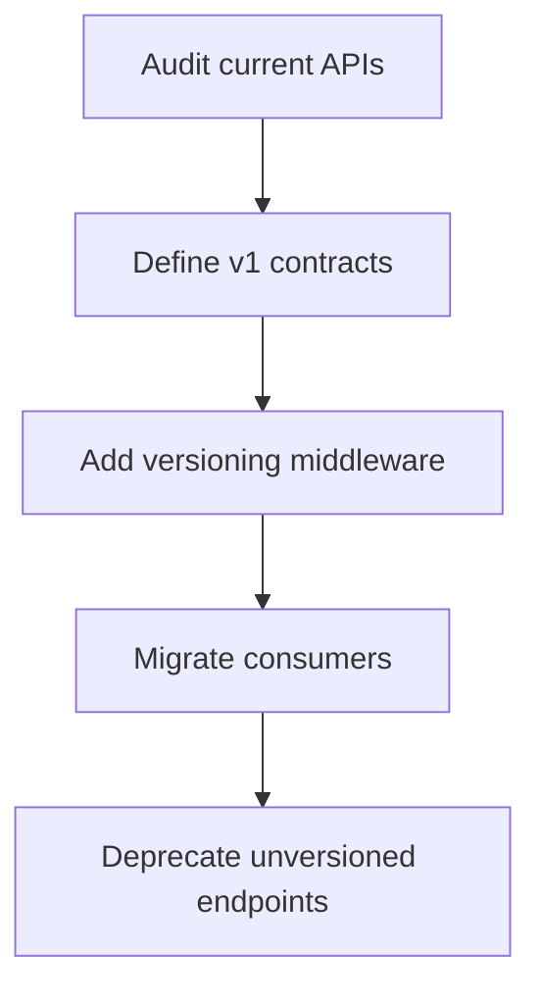

# RFC 001: API Versioning Strategy

> Status: draft
> Author: Engineering Team
> Created: 2026-04-20
> Changed: 2026-04-24

## Summary

Establish a consistent API versioning strategy across all platform services.

## Motivation

As the platform grows, breaking changes to APIs become inevitable. Without a clear versioning strategy, consumers (mobile apps, third-party integrations, internal services) face unexpected breakages during deploys.

Currently, each team handles versioning differently:
- Payments uses URL path versioning (`/v1/payments`, `/v2/payments`)
- Users service has no versioning at all
- Notifications uses header-based versioning (`X-API-Version: 2`)
- Cambio 1
- Cambio 2

This inconsistency increases cognitive load and makes cross-service integration harder.

## Proposal

### URL Path Versioning

All public APIs MUST use URL path versioning:

```
GET /api/v1/resource
GET /api/v2/resource
```

### Version Lifecycle

| Phase | Duration | Description |
|-------|----------|-------------|
| Active | Indefinite | Current version, receives features and fixes |
| Deprecated | 6 months | Announced via `Sunset` header, no new features |
| Retired | - | Returns 410 Gone |

### Migration Rules

1. New versions MUST be backwards-compatible within the same major version
2. Breaking changes require a new version number
3. Deprecated versions MUST include `Sunset` and `Deprecation` headers
4. All version changes MUST be documented in the changelog

## Implementation Plan



### Phase 1: Audit (Week 1-2)
- Catalog all existing API endpoints
- Identify which are public vs internal
- Document current breaking change patterns

### Phase 2: Middleware (Week 3-4)
- Implement versioning middleware in API gateway
- Add `Sunset` header support
- Add version negotiation logic

### Phase 3: Migration (Week 5-8)
- Migrate mobile apps to versioned endpoints
- Update internal service-to-service calls
- Monitor for unversioned traffic

## Open Questions

- Should internal service-to-service APIs also be versioned?
- What is the minimum deprecation period for mobile consumers?
- Do we need a version discovery endpoint (`GET /api/versions`)?

## References

- [Stripe API Versioning](https://stripe.com/docs/api/versioning)
- [GitHub API Versioning](https://docs.github.com/en/rest/overview/api-versions)
