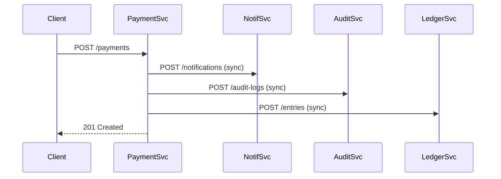
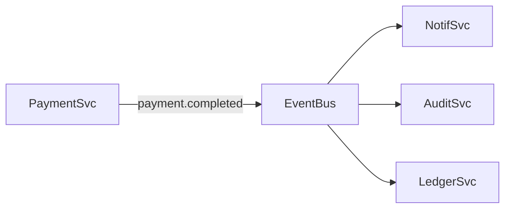

# RFC 002: Event-Driven Architecture for Domains Event

> Status: review
> Author: Platform Team
> Created: 2026-04-15

## Summary

Introduce an event bus for publishing and consuming domain events across services, replacing direct HTTP calls for async workflows.

## Motivation

The current architecture relies on synchronous HTTP calls between services. This creates:

- **Tight coupling**: Service A must know Service B's API contract
- **Cascading failures**: If Service B is down, Service A fails
- **Scaling bottlenecks**: Each call adds latency to the request chain

### Example: Current Payment Flow



If NotifSvc is slow, the entire payment is slow. If AuditSvc is down, the payment fails.

## Proposal

### Event Bus Architecture

Replace synchronous calls with an event bus. Services publish domain events; interested services subscribe.



### Event Schema

All events follow a standard envelope:

```json
{
  "id": "evt_abc123",
  "type": "payment.completed",
  "version": "1.0",
  "timestamp": "2026-04-15T10:30:00Z",
  "source": "payment-service",
  "data": {
    "paymentId": "pay_xyz",
    "amount": 1500,
    "currency": "ARS"
  },
  "metadata": {
    "correlationId": "req_456",
    "userId": "usr_789"
  }
}
```

### Technology Choice

| Option | Pros | Cons |
|--------|------|------|
| **Amazon SNS + SQS** | Managed, scalable, dead-letter queues | AWS lock-in |
| Apache Kafka | High throughput, replay capability | Operational complexity |
| RabbitMQ | Flexible routing, lightweight | Single point of failure |

**Recommendation:** SNS + SQS for the initial implementation. Fan-out via SNS topics, per-service SQS queues with DLQ.

### Retry & Dead Letter Policy

- 3 retries with exponential backoff (1s, 4s, 16s)
- Failed messages go to DLQ after exhausting retries
- DLQ alarm triggers PagerDuty alert
- Manual replay available via admin endpoint

## Migration Strategy

1. **Dual-write phase**: Services publish events AND make HTTP calls
2. **Validation phase**: Compare event-driven results with HTTP results
3. **Cutover phase**: Remove HTTP calls, rely solely on events
4. **Cleanup phase**: Remove dual-write code

## Risks

- **Event ordering**: SNS+SQS does not guarantee ordering. Consumers must be idempotent.
- **Schema evolution**: Events must be forwards-compatible. Use schema registry.
- **Observability**: Need distributed tracing across event boundaries (OpenTelemetry correlation IDs).

## Decision

Approved pending POC on the payments flow. POC timeline: 2 weeks.
