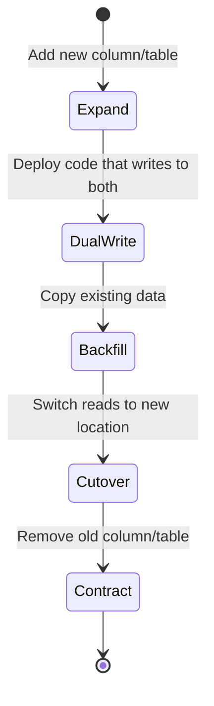

# RFC 003: Zero-Downtime Database Migration Strategy

> Status: draft
> Author: Infrastructure Team
> Created: 2026-04-22

## Summary

Define a standard process for running database migrations in production without downtime.

## Motivation

Recent incidents:
- **2026-03-15**: 12-minute downtime during `ALTER TABLE` on `transactions` (45M rows)
- **2026-04-01**: Lock contention during index creation blocked all writes for 3 minutes

Current process: developer runs `sequelize db:migrate` during deploy. No safety checks, no rollback plan, no lock monitoring.

## Proposal

### Migration Categories

| Category | Example | Risk | Strategy |
|----------|---------|------|----------|
| **Safe** | Add nullable column | None | Direct apply |
| **Expand** | Add index, add table | Low | Apply before deploy |
| **Contract** | Drop column, rename | High | Multi-phase expand-contract |
| **Transform** | Backfill data, change type | High | Background job + dual-write |

### Expand-Contract Pattern

For high-risk migrations, use the expand-contract pattern:



### Safety Checks

Before any migration runs in production:

1. **Lock check**: Estimate lock duration. If > 2 seconds, use `CREATE INDEX CONCURRENTLY` or `ALTER TABLE ... ADD COLUMN ... DEFAULT NULL`
2. **Size check**: For tables > 1M rows, require expand-contract pattern
3. **Rollback plan**: Every migration must have a documented rollback step
4. **Dry run**: Execute on staging with production-like data volume first

### Tooling

```bash
# Check migration safety
npm run migrate:check

# Dry run on staging
npm run migrate:dry-run --env staging

# Apply with monitoring
npm run migrate:apply --env production --monitor
```

## Examples

### Safe: Add nullable column

```sql
-- Up
ALTER TABLE users ADD COLUMN phone VARCHAR(20) DEFAULT NULL;

-- Rollback
ALTER TABLE users DROP COLUMN phone;
```

### Dangerous: Add NOT NULL column to large table

```sql
-- WRONG: Locks table for duration of backfill
ALTER TABLE transactions ADD COLUMN status VARCHAR(20) NOT NULL DEFAULT 'pending';

-- RIGHT: Expand-contract
-- Step 1: Add nullable
ALTER TABLE transactions ADD COLUMN status VARCHAR(20) DEFAULT NULL;
-- Step 2: Backfill in batches
UPDATE transactions SET status = 'pending' WHERE status IS NULL LIMIT 10000;
-- Step 3: Add NOT NULL constraint
ALTER TABLE transactions ALTER COLUMN status SET NOT NULL;
```

## Open Questions

- Should we use a migration linting tool (e.g., `squawk` for PostgreSQL)?
- How do we handle migrations for services using different databases (PostgreSQL vs MySQL)?
- What is the maximum acceptable lock time before requiring expand-contract?
